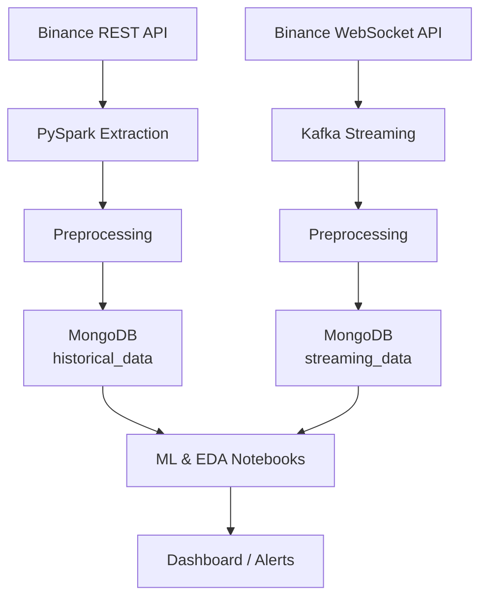

# Step 1: Discovery of Available Data Sources & Data Organisation

## 1. Project Context & Scope

The goal of the CryptoBot project is to build a trading bot that analyzes cryptocurrency markets using Machine Learning, in order to generate investment opportunity alerts. We focus on real-time and historical data for selected crypto pairs, and all data engineering and automation is built using modern open-source tools.

- **Selected pairs:** BTC/USDT and ETH/USDT
- **Main features:** Risk aversion, volatility, transaction volume analysis, investment alerts
- **End product:** Dashboard for investment alerts, ML model for buy/sell signals, fully automated with Docker and Airflow

## 2. Data Sources

We will only use the **Binance API**:

- **Historical data:** Retrieved with the Binance REST API, extracted and processed using **PySpark**
- **Streaming data:** Retrieved in real time using the Binance WebSocket API, streamed through **Kafka**

**No web scraping or SQL databases are used in this project.**  
All data storage and retrieval is based on **MongoDB**.

## 3. Data Organisation

### Overview

- **Historical data:** Pulled in batches from the Binance REST API using PySpark
- **Streaming data:** Pulled in real-time from the Binance WebSocket API using Kafka

Both data types are preprocessed and stored in separate collections within a single **MongoDB** database:

- `historical_data` (for historical market data)
- `streaming_data` (for real-time market data)

All transformations, feature engineering, and ML pipelines are managed in Jupyter notebooks and modular Python scripts.

## 4. Data Architecture Diagram




## 5. Project Data Structure

```
cryptobot/
├── data/
│   ├── external/
│   ├── interim/
│   ├── processed/
│   └── raw/
├── logs/
├── models/
├── notebooks/
├── references/
├── reports/
│   └── figures/
├── requirements.txt
├── docker-compose.yml
├── .env
└── src/
    ├── __init__.py
    ├── config/
    │   └── config.yaml
    ├── data/
    │   ├── __init__.py
    │   ├── make_dataset.py
    │   └── kafka_stream.py
    ├── db/
    │   ├── __init__.py
    │   └── mongo_utils.py
    ├── features/
    │   ├── __init__.py
    │   └── build_features.py
    ├── models/
    │   ├── __init__.py
    │   ├── train_model.py
    │   └── predict_model.py
    ├── api/
    │   ├── __init__.py
    │   └── main.py
    └── visualization/
        ├── __init__.py
        └── dash_app.py
```

## 6. Data Organisation

- **Data Sources:**
    - **Binance API** (for both historical and streaming data)
- **Ingestion Layer:**
    - **PySpark** (for historical data extraction)
    - **Kafka** (for streaming data)
- **Storage Layer:**
    - **MongoDB** (two collections: `historical_data`, `streaming_data`)
- **Processing Layer:** 
    - **Jupyter Notebooks** (for EDA and model prototyping)
    - **PySpark** (for data cleaning and transformation)
- **API Layer:**
    - **FastAPI** (provides endpoints to retrieve processed/aggregated data, and can be used for dashboard authentication and data delivery)
- **Visualization Layer:** 
    - **Dash** (dashboard consuming API endpoints)

| **Purpose/Task**           | **Tool / Technology** | **Notes / Description**                            |
| -------------------------- | --------------------- | -------------------------------------------------- |
| Data Source - Historical   | Binance REST API      | For downloading past OHLCV data                    |
| Data Source - Streaming    | Binance WebSocket API | For real-time market data                          |
| Historical Data Extraction | PySpark               | Batch extraction and transformation                |
| Streaming Data Processing  | Kafka                 | Handling streaming data pipelines                  |
| Data Storage (DB)          | MongoDB               | Two collections: historical_data, streaming_data   |
| Containerization           | Docker                | To deploy all components as services               |
| Orchestration / Scheduling | Airflow               | Automation and scheduling of data workflows        |
| Machine Learning           | Scikit-learn, XGBoost | Model training (Random Forest, XGBoost)            |
| Scripting / Programming    | Python                | Core language for all development                  |
| Exploratory Data Analysis  | Jupyter Notebooks     | EDA, prototyping, documentation                    |
| Visualization / Dashboard  | Dash                  | Building interactive dashboards for alerts         |
| API                        | FastAPI               | Exposing ML predictions and/or metrics             |
| Logs                       | Built-in / Logging    | Store logs of data pipelines                       |
| Environment Management     | .env files            | Store environment variables (never commit secrets) |
| Project Management         | Git                   | Version control for all source code                |

### 🔍 Data Sources Identified

| Source                | Access Method             | Data Type                            |
| --------------------- | ------------------------- | ------------------------------------ |
| Binance REST API      | `https://api.binance.com` | Market data (prices, trades, klines) |
| Binance WebSocket API | Real-time JSON stream     | Live market changes                  |

---

### 📊 Initial Focused Data

|Endpoint (Binance)|Description|Feature used for|
|---|---|---|
|`/api/v3/klines`|Historical OHLCV candles|Volatility, price trends|
|`/api/v3/ticker/price`|Latest price|Live updates|
|`/api/v3/trades`|Recent trades|Volume analysis|
|`/api/v3/exchangeInfo`|Trading pairs & filters|Available pairs, validation|
